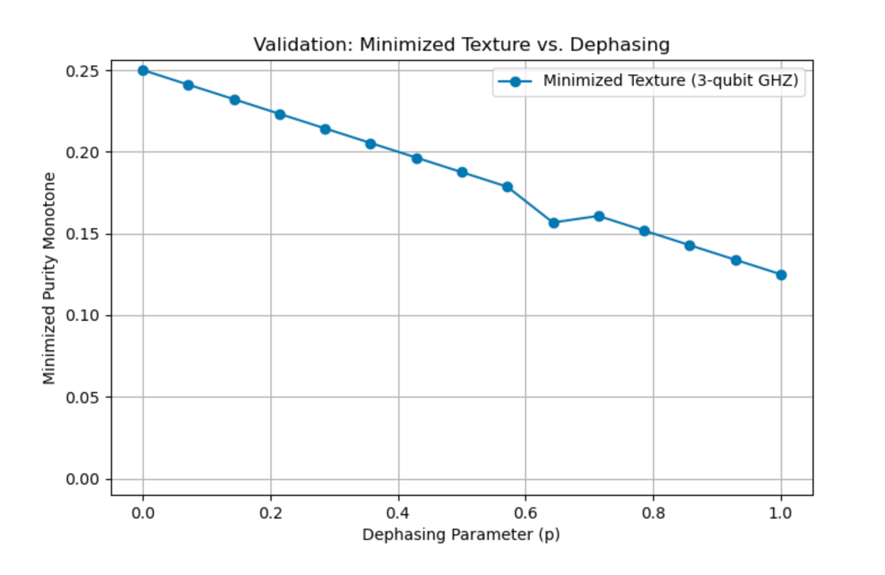
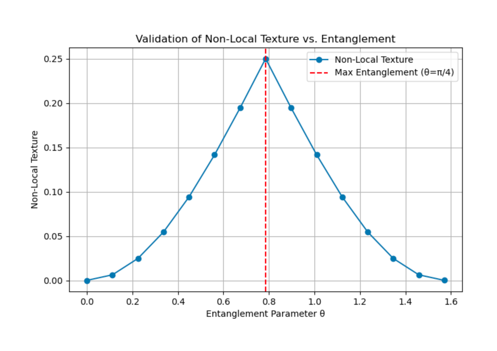
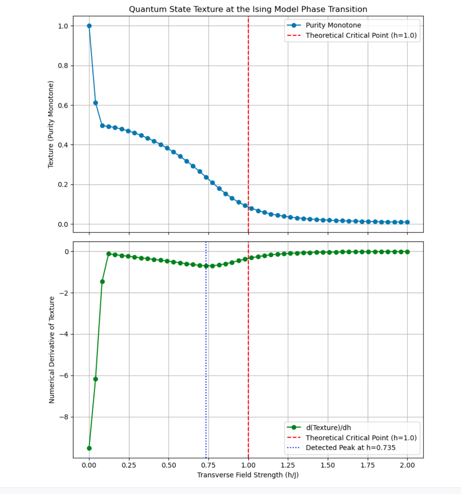
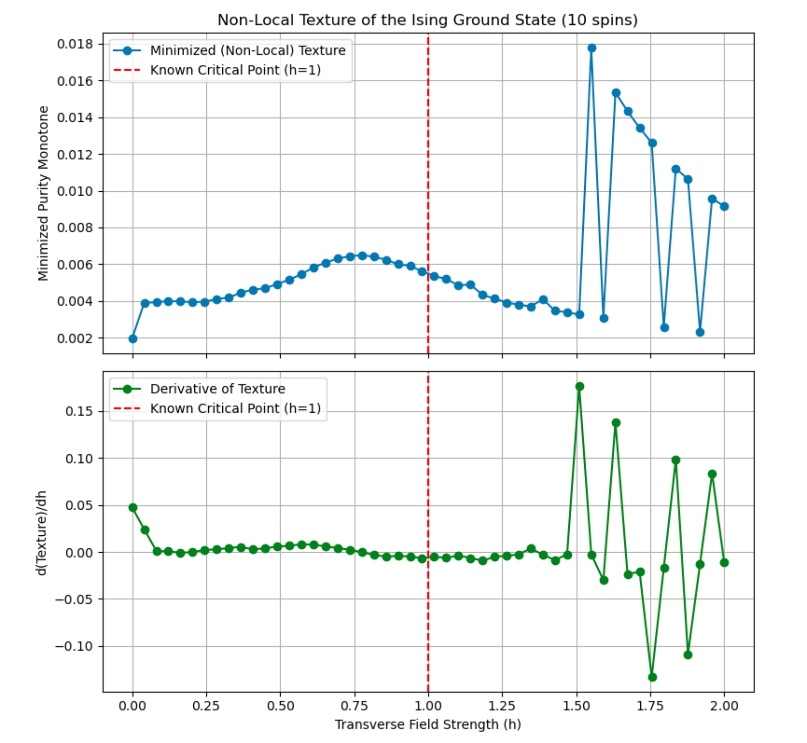

# Validation Examples for the `qtexture` Library

This document provides a detailed explanation of the validation scripts included in the `qtexture` library. Each script is designed to test a specific aspect of the library's functionality, from basic monotone calculations to the advanced `minimize_texture` optimizer. The goal is to demonstrate that the library's tools behave as expected according to the principles of quantum mechanics and the theory of quantum state texture.

---

## 1. Dephasing a GHZ State

This validation test ensures that the minimized texture correctly functions as a measure of quantum coherence. As a pure quantum state is "dephased" (i.e., mixed with a completely random state), its coherence is lost. A reliable measure should reflect this loss by decreasing towards zero.

* **File:** `validate_dephasing.py`
* **Function Tested:** `minimize_texture()`

### Methodology

1.  A pure, 3-qubit **GHZ state** is created. This is a highly entangled and coherent state, which should have a significant amount of texture.
2.  A **maximally mixed state** is also created. This state represents complete classical uncertainty and has no coherence or texture.
3.  A new state is generated by mixing the two: $\rho(p) = (1-p)\rho_{GHZ} + p \rho_{mixed}$.
4.  The script iterates through the mixing parameter `p` from 0 (pure GHZ) to 1 (fully mixed). For each value of `p`, it runs the `minimize_texture` optimizer to find the state's intrinsic texture.

### Expected Result

The minimized texture should **smoothly decrease as the dephasing parameter `p` increases**. When `p=0`, the texture will be at its maximum. As the state becomes more mixed and less coherent, the texture should diminish, ultimately reaching **zero** when the state is maximally mixed at `p=1`.

### Actual Result



---

## 2. Tracking Entanglement in a Tunable State

This test validates that the "non-local texture" (texture minimized over local bases) serves as a valid indicator of entanglement. It uses a simple, two-qubit state where the amount of entanglement can be precisely controlled by a single parameter, $\theta$.

* **File:** `validate_nonlocal_texture.py`
* **Function Tested:** `minimize_texture()` with `subsystems` specified.

### Methodology

1.  A tunable two-qubit state is defined as $|\psi(\theta)\rangle = \cos(\theta)|00\rangle + \sin(\theta)|11\rangle$.
2.  The script varies the parameter $\theta$ from 0 to $\pi/2$.
    * At $\theta=0$, the state is $|00\rangle$ (a separable, non-entangled state).
    * At $\theta=\pi/4$, the state is $(|00\rangle + |11\rangle)/\sqrt{2}$ (a maximally entangled Bell state).
    * At $\theta=\pi/2$, the state is $|11\rangle$ (also a separable, non-entangled state).
3.  For each value of $\theta$, the script calculates the non-local texture by minimizing it over all local unitary operations on both qubits.

### Expected Result

The non-local texture should be **zero when the state is separable** (at $\theta=0$ and $\theta=\pi/2$) and should **peak precisely when the state is maximally entangled** (at $\theta=\pi/4$). The resulting plot should be a symmetric curve that starts at zero, rises to a maximum at the midpoint, and returns to zero.

### Actual Result



---

## 3. Detecting a Quantum Phase Transition (Basis-Dependent)

A key application of quantum information measures is the detection of quantum phase transitions. This test validates that the simple, basis-dependent `calculate_purity_monotone` is sensitive enough to identify the well-known critical point in the Transverse Field Ising Model.

* **File:** `run_phase_transition_study.py`
* **Function Tested:** `calculate_purity_monotone()`

### Methodology

1.  The ground state of the 1D Transverse Field Ising Model is calculated for a range of transverse field strengths, `h`.
2.  The model is known to have a quantum phase transition at the critical point `h=1`.
3.  For each ground state, the script calculates the standard purity monotone in the computational basis.
4.  The numerical derivative of the texture with respect to `h` is then computed.

### Expected Result

While the texture itself changes smoothly, its **derivative should exhibit a sharp peak at or very near the theoretical critical point of `h=1`**. This peak signifies a sudden change in the nature of the ground state, which is the hallmark of a phase transition.

### Actual Result



---

## 4. Detecting a Quantum Phase Transition (Optimizer)

This is a more advanced version of the previous test. It validates that the `minimize_texture` optimizer, when used to calculate the intrinsic non-local texture, can also detect the Ising model's phase transition. This demonstrates the scientific utility of the advanced, basis-independent measures.

* **File:** `minimize_texture_with_prog_qaoa.py`
* **Function Tested:** `minimize_texture()`

### Methodology

1.  The setup is identical to the previous validation: the ground state of the Ising model is found for a range of field strengths `h`.
2.  However, instead of a simple calculation, the `minimize_texture` optimizer is run for each ground state to find the minimal non-local texture.
3.  The derivative of this *minimized* texture with respect to `h` is then plotted.

### Expected Result

Just like the simpler basis-dependent measure, the **derivative of the minimized non-local texture is expected to show a distinct peak around the critical point `h=1`**. This confirms that the intrinsic, basis-independent texture is a valid witness to the quantum phase transition.

### Actual Result



---

## 5. Comparing GHZ and W States

Not all entangled states are created equal. The GHZ and W states are canonical examples of two different classes of multipartite entanglement. This example demonstrates using non-local texture to numerically distinguish between them, validating that the measure is sensitive to different "flavors" of entanglement.

* **File:** `compare_entangled_states_updated.py`
* **Function Tested:** `minimize_texture()`

### Methodology

1.  A 3-qubit **GHZ state** and a 3-qubit **W state** are created.
2.  The `minimize_texture` optimizer is called on each state to find the minimal texture after optimizing over all local measurement bases.
3.  The final minimized values are printed and compared.

### Scientific Context: Why GHZ Texture Should Be Higher

The **non-local texture** is designed to be a measure of **multipartite entanglement**. A higher value implies that the state possesses more of this specific quantum resource. The GHZ and W states are known to possess fundamentally different entanglement structures:

* **GHZ State: Global Correlation**
    The GHZ state, $(|000\rangle + |111\rangle)/\sqrt{2}$, exhibits a fragile, "all-or-nothing" entanglement. The correlation is a true three-party property. If you measure just one of the three qubits, the global entanglement is completely destroyed.

* **W State: Robust Pairwise Correlation**
    The W state, $(|100\rangle + |010\rangle + |001\rangle)/\sqrt{3}$, has a more resilient entanglement that is distributed among pairs. If you measure one qubit, the other two *remain entangled*.

Because the GHZ state's entanglement is intrinsically global and cannot be reduced to pairwise correlations, it is considered a stronger form of genuine *multipartite* entanglement.

### Expected Result

The minimized texture for the GHZ state is expected to be **higher** than that of the W state. This outcome would confirm that the library's non-local texture measure correctly identifies the GHZ state as possessing a stronger form of multipartite entanglement, aligning with established quantum information theory.

### Actual Result

```text
--- Comparison Results ---
Non-Local Texture (GHZ): 0.2500
Non-Local Texture (W):   0.2412

The GHZ state has a higher non-local texture than the W state.
```
